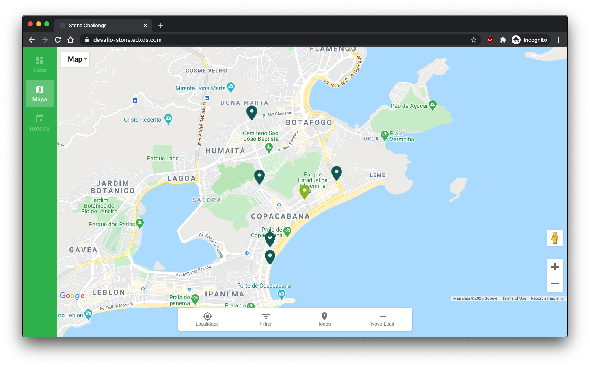
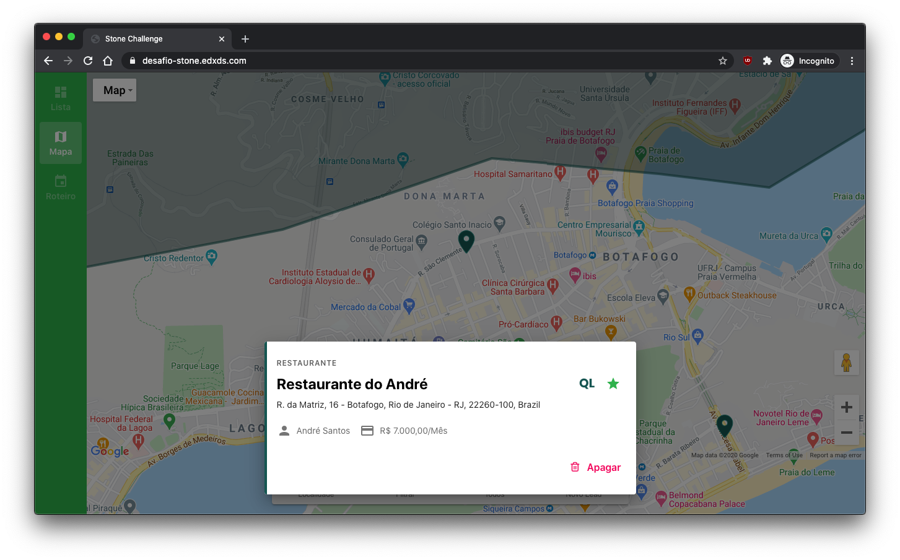
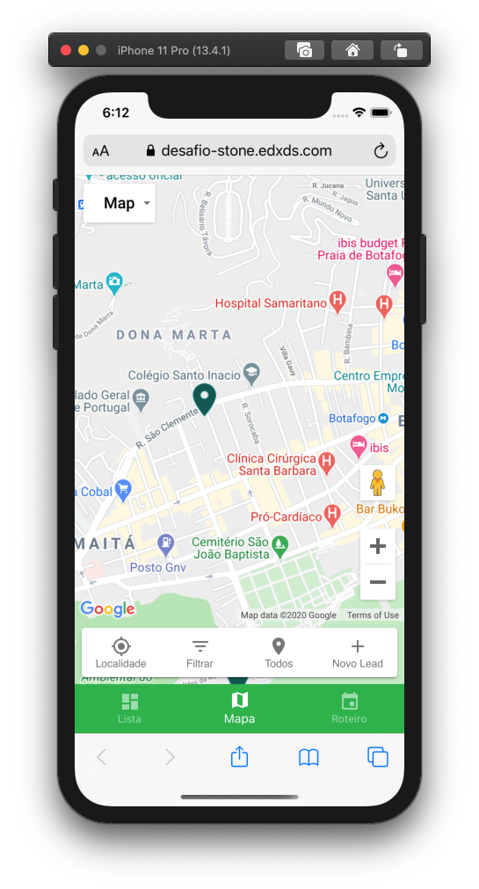

<h2 align="center">Desafio Técnico Stone</h3>

  <a href="https://desafio-stone.edxds.com">Visitar Demo</a>
   
   

## ✨ Features

- Selecionar região
- Selecionar polo
  - Com um polo selecionado, somente pins no polo são exibidos
- Filtros
  - Filtrar por tipo de pin
  - Filtrar por média mensal
  - Filtrar somente favoritos
- Leads
  - Criar novos leads no mapa
  - Ver detalhes de um lead
  - Favoritar um lead
  - Apagar um lead

 

## 🛠 Scripts Disponíveis

No diretório do projeto, você pode rodar:

### `yarn start`

Roda a aplicação em modo de desenvolvimento.\
Abra [http://localhost:3000](http://localhost:3000) para a ver no navegador.

A página irá recarregar se você fizer mudanças.\
Você também verá erros de linting no seu terminal.

### `yarn build`

Compila a aplicação para produção na pasta `build`.\
Prepara e otimiza a aplicação React para melhor performance.

 

## 📸 Screenshots

